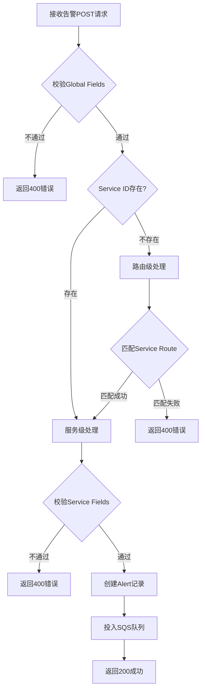
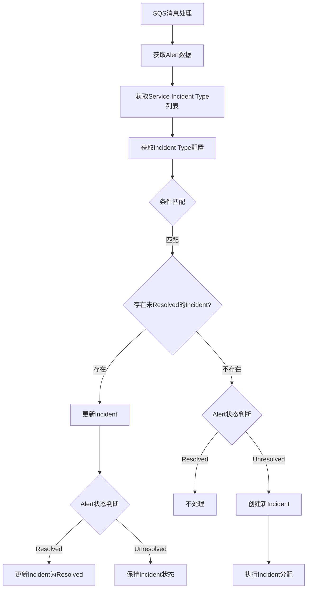
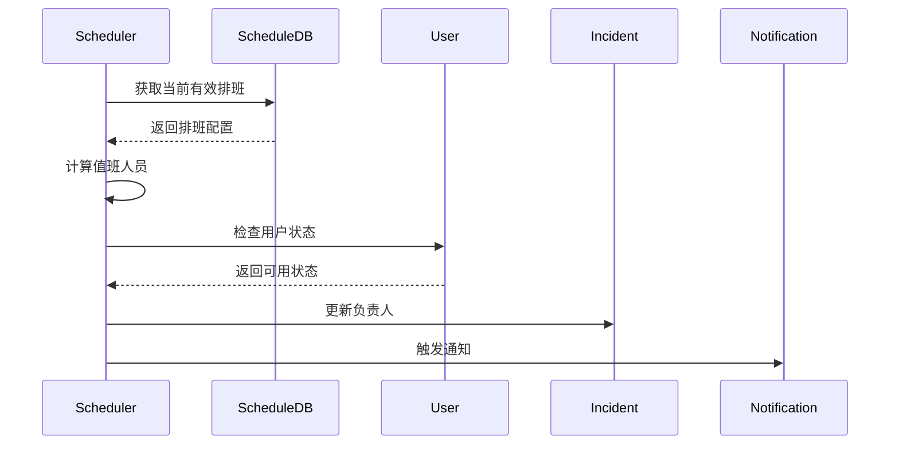
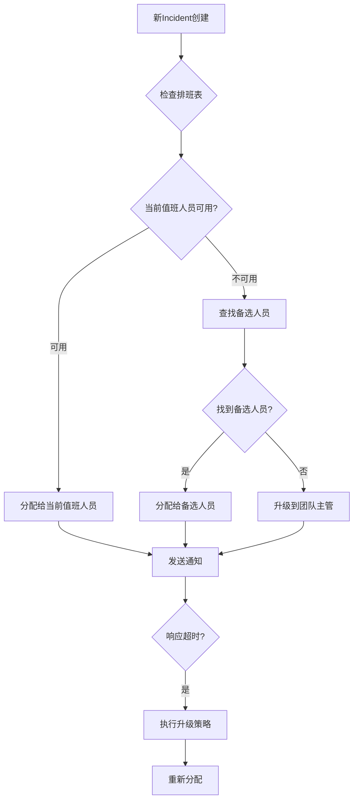
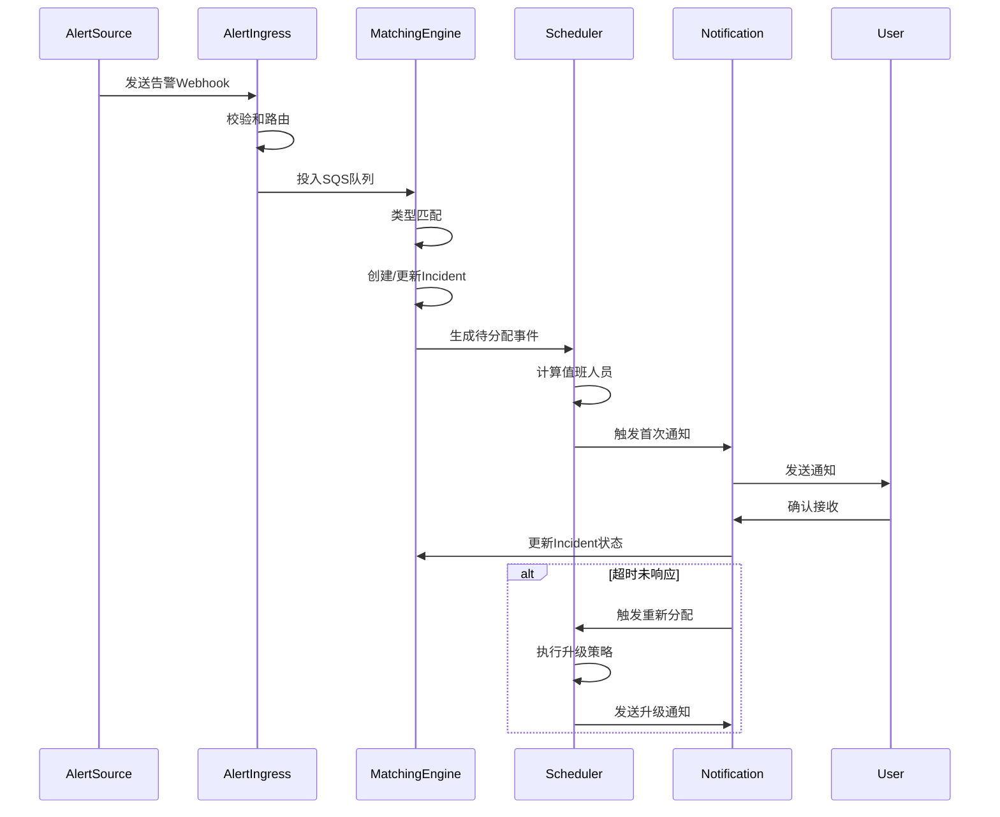

# 事件管理平台产品设计方案

## 1. 系统概述

事件管理平台是一个集中化的告警处理和事件管理系统，用于接收、处理和管理来自各种监控系统的告警信息，并根据预定义的规则自动创建和管理事件（Incidents）。系统支持多渠道通知、智能事件分配和灵活的值班排班管理。

## 2. 核心流程模块

### 2.1 告警接收路由系统



#### 2.1.1 告警接收处理流程
- **接口定义**：`POST /alert/?:serviceId`
- **输入**：Alert事件JSON, Service Id (可选)
- **处理流程**：
  1. 校验事件JSON是否符合Global Fields
  2. 根据Service Id或Service Route规则匹配服务
  3. 校验事件JSON是否符合Service Fields
  4. 创建Alert记录并关联Service
  5. 将Alert Id投入SQS队列

#### 2.1.2 SQS配置
- **队列名称**：AlertQueue
- **队列URL**：https://sqs.us-east-1.amazonaws.com/123456789012/AlertQueue
- **队列类型**：Standard
- **消息处理程序**：AlertHandler
- **处理程序参数**：AlertId

### 2.2 事件类型匹配引擎



#### 2.2.1 条件解析器
- **功能**：解析IncidentType中定义的JSON格式条件规则
- **技术实现**：基于json-rules-engine
- **条件示例**：
  ```json
  {
    "conditions": {
      "all": [
        {
          "fact": "service",
          "operator": "equal",
          "value": "database"
        },
        {
          "fact": "severity",
          "operator": "greaterThanInclusive",
          "value": "high"
        }
      ]
    }
  }
  ```

#### 2.2.2 状态决策树
- **功能**：基于Alert时间序列的状态机演进
- **状态转换规则**：
  - 新Alert到达 → 创建或更新Incident
  - Resolved Alert到达 → 判断是否关闭Incident
  - 超时未处理 → 触发升级策略

#### 2.2.3 自动关联模块
- **功能**：实现Alert与Incident的自动关联逻辑
- **关联策略**：
  - 基于服务和组件关系
  - 基于时间窗口
  - 基于告警内容相似度

## 3. 调度管理模块

### 3.1 值班规则引擎



#### 3.1.1 轮换规则
- **标准轮换**：每周轮换一次
- **快速轮换**：每天轮换一次
- **自定义轮换**：支持自定义时间段

#### 3.1.2 假期处理
- **替班机制**：允许提前安排替班
- **备选人员**：紧急情况下的备选人员机制
- **自动跳过**：自动跳过休假人员的排班

#### 3.1.3 临时调整
- **换班申请**：支持临时换班申请
- **紧急调配**：紧急情况下的人员调配
- **记录追踪**：调整记录追踪

#### 3.1.4 时区处理
- **跨时区策略**：跨时区团队的排班策略
- **本地时间**：考虑当地工作时间
- **节假日调整**：节假日自动调整

### 3.2 Incident分配策略



#### 3.2.1 分配规则
- **基于时间**：当incident在指定时间内没有被acknowledge或resolved，重新分配
- **基于数量**：当incident中的alert数量大于指定数量，触发重新分配
- **基于响应**：被分配的user在指定时间内没有处理incident，分配给其他User

## 4. 通知策略模块

### 4.1 多渠道通知网关

#### 4.1.1 通知渠道类型

系统支持以下通知渠道类型，可根据需求进行配置：

| 渠道类型 | 说明 | 适用场景 |
|----------|------|----------|
| 系统内通知 | 仅在系统界面内显示通知 | 低优先级事件 |
| App消息通知 | 通过移动应用发送普通推送消息 | 常规通知 |
| App呼叫通知 | 通过移动应用发送连续震动响铃弹窗通知 | 紧急事件 |

#### 4.1.2 通知级别与渠道配置

系统默认配置如下，管理员可在配置中心进行自定义调整：

| 通知级别 | 默认渠道组合 | 响应超时 | 升级规则 |
|----------|----------|----------|----------|
| Critical | App呼叫通知 | 5分钟 | 15分钟未读转主管 |
| High | App呼叫通知 | 10分钟 | 30分钟未读转二线 |
| Medium | App消息通知 | 15分钟 | 30分钟未读升级为呼叫通知 |
| Low | App消息通知 | 30分钟 | 无自动升级 |
| Emergency | App呼叫通知 | 3分钟 | 10分钟未读转高管 |
| Normal | 仅系统内通知 | 无 | 无自动升级 |

### 4.2 通知频率控制
- **间隔控制**：相同级别的通知间隔不少于5分钟
- **数量限制**：24小时内最大通知次数限制
- **合并通知**：批量告警自动合并通知

### 4.3 通知升级机制
- **初次升级**：初次通知后15分钟内未响应，升级通知方式
- **二次升级**：30分钟内未响应，通知主管
- **最终升级**：60分钟内未响应，通知更高级别管理者

### 4.4 免打扰时段
- **个人设置**：可配置个人免打扰时段
- **延迟发送**：除Critical/Emergency外其他通知将延迟发送
- **自动分配**：免打扰时段的告警自动分配给其他在线人员

## 5. 配置中心

### 5.1 服务路由配置

```typescript
interface RouteConfig {
    matchConditions: Condition[]
    priorityRules: {
        field: keyof Alert
        comparator: '>' | '<' | '=='
        threshold: number
    }[]
}
```

### 5.2 Incident类型配置

```typescript
interface IncidentTypeConfig {
    name: string
    description: string
    service: Service
    conditions: {
        type: 'all' | 'any'
        rules: {
            field: string
            operator: string
            value: any
        }[]
    }
    statusConditions: {
        resolved: {
            field: string
            operator: string
            value: any
        }[]
    }
    priority: string
    assignTo: {
        type: 'user' | 'team' | 'schedule'
        id: string
    }
}
```

### 5.3 排班计划管理
- **可视化排班日历**：直观展示排班计划
- **自动冲突检测**：检测并提示排班冲突
- **历史值班记录追溯**：记录并查询历史值班情况

### 5.4 Priority升级策略

```typescript
interface PriorityEscalationRule {
    condition: {
        type: 'timeout' | 'alertCount' | 'custom'
        value: number | string
    }
    newPriority: string
    notifyTo?: {
        type: 'user' | 'team' | 'role'
        id: string
    }
}
```

## 6. 系统交互流程



## 7. 用户界面设计

### 7.1 Web管理控制台

#### 7.1.1 Dashboard
- **实时统计**：当前活跃Incident数量、按优先级分布
- **值班信息**：当前值班人员、下一班次
- **最新事件**：最近创建和更新的Incident

#### 7.1.2 Incident管理
- **列表视图**：支持多维度筛选和排序
- **详情页**：完整展示Incident信息、关联Alert、处理记录
- **操作面板**：提供快速处理和分配功能

#### 7.1.3 配置管理
- **服务配置**：管理服务和路由规则
- **排班管理**：可视化排班日历和规则设置
- **用户和团队**：管理用户权限和团队结构

### 7.2 移动应用

#### 7.2.1 通知中心
- **实时推送**：接收实时告警通知
- **快速操作**：一键确认和处理
- **语音呼叫**：高优先级事件的语音提醒

#### 7.2.2 Incident处理
- **简洁视图**：优化移动端展示
- **离线支持**：支持离线查看和操作
- **位置感知**：基于位置的值班提醒

## 8. API接口设计

### 8.1 告警接收API
- **POST /api/v1/alerts**：接收标准格式告警
-